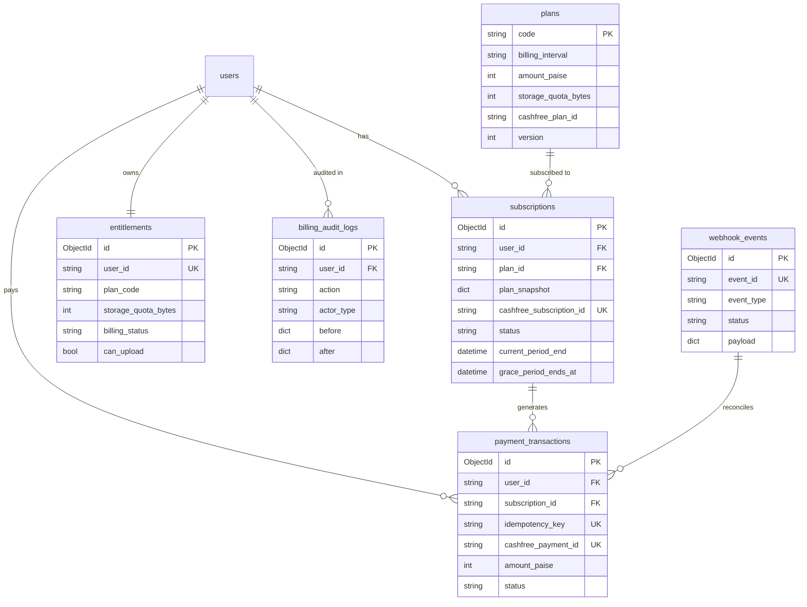
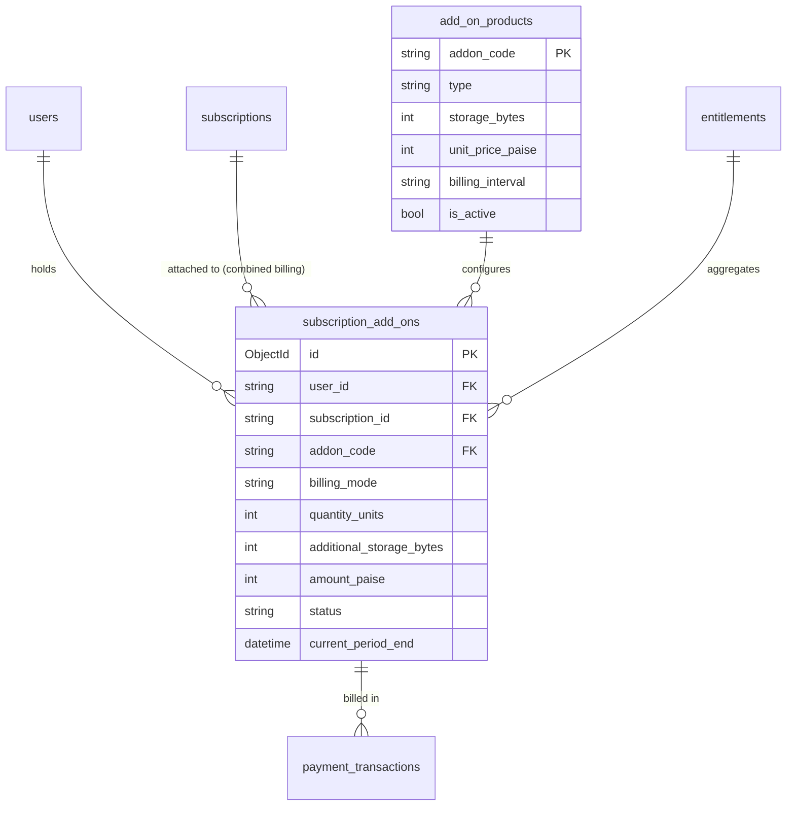

# GetFileNova v2.0 — Billing Database Architecture & Storage Add-ons Plan

**Document Version:** 2.0.0  
**Status:** Approved Architecture Plan with Version 2 Add-on Extensions  
**Target Repository:** `file-manager-backend`  
**Framework:** FastAPI + Motor + Beanie ODM + PyMongo + Pydantic v2  

---

## 1. Executive Summary & Architecture Scope

### 1.1 Scope Separation: Version 1 vs. Version 2 Add-ons

| Release Phase | Core Objectives & Scope | Database Collections Required | Provider Interactions |
| :--- | :--- | :--- | :--- |
| **Version 1: Core Recurring Subscriptions** | - Canonical plan catalog (`free`, `personal`, `plus`, `power`).<br>- Monthly and annual Cashfree recurring subscriptions.<br>- Lifetime one-time purchases.<br>- Idempotent webhook processing and signature verification.<br>- User cancellation and 14-day renewal grace period.<br>- Basic entitlements (single plan quota). | 1. `plans`<br>2. `subscriptions`<br>3. `payment_transactions`<br>4. `webhook_events`<br>5. `entitlements`<br>6. `billing_audit_logs` | - Cashfree Subscriptions API (`/subscriptions`) for recurring tiers.<br>- Cashfree PG Orders (`/pg/orders`) for lifetime tiers.<br>- Cashfree Webhooks. |
| **Version 2: Storage Add-on Architecture** | - Predefined storage packs (+50 GB, +100 GB, +500 GB).<br>- Custom storage amounts with configurable per-GB pricing.<br>- **Combined Billing:** Co-termed add-ons synchronizing with base subscription billing cycle.<br>- **Separate Billing:** Independent add-on billing cycles and lifecycles.<br>- Composite storage entitlement calculation. | 7. `add_on_products`<br>8. `subscription_add_ons`<br>*(plus additive fields in `entitlements` and `payment_transactions`)* | - Mid-cycle proration invoices via PG Orders.<br>- Standalone recurring mandates or mandate cap adjustments on Cashfree. |

---

## 2. Existing Collections & Fields Inventory (Preserved)

| Collection Name | Beanie Model | Preserved Key Fields | Backward Compatibility Guarantee |
| :--- | :--- | :--- | :--- |
| `users` | `User` | `_id`, `email`, `storage_limit_bytes`, `pricing_plan`, `billing_cycle`, `subscription_status`, `trial_started_at`, `trial_expires_at`, `subscription_expires_at`, `canceled_at`, `cancellation_reason`, `customer_id`, `phone` | **Strictly Preserved:** Dual-written on entitlement updates. Existing endpoints and auth tokens continue reading `User.storage_limit_bytes`. |
| `payment_records` | `PaymentRecord` | `_id`, `user_id`, `customer_id`, `order_id`, `cf_order_id`, `cf_payment_id`, `payment_session_id`, `amount`, `currency`, `plan_name`, `billing_cycle`, `status`, `payment_method`, `created_at`, `updated_at`, `subscription_expires_at`, `raw_response` | **Preserved Read-Only Ledger:** Historical records remain unchanged. Legacy APIs continue querying without disruption. |
| `cancellation_records` | `CancellationRecord` | `_id`, `user_id`, `customer_name`, `customer_email`, `plan_name`, `billing_cycle`, `is_trial`, `reason`, `created_at` | **Preserved:** Historical admin cancellation records remain intact. |
| `file_system_items` | `FileSystemItem` | `_id`, `name`, `type`, `size`, `user_id`, `parent_id`, `is_deleted`, `is_locked`, `partition_id` | **Preserved:** Core file manager storage aggregation logic (`type == 'file'` and `is_deleted == False`) remains untouched. |
| `storage_partitions` | `StoragePartition` | `_id`, `user_id`, `name`, `allocated_size_bytes`, `is_locked` | **Preserved:** Virtual drive allocations are validated against composite storage quota. |
| `roles` | `Role` | `_id`, `key`, `name`, `permissions`, `is_default` | **Preserved:** RBAC authorization is untouched. |

---

## 3. Version 1 Core Billing Collections (Implemented)



---

## 4. Version 2 Storage Add-on Architecture

To fulfill the Version 2 requirements (predefined packs, custom per-GB pricing, combined billing, and separate billing), two new additive collections and lightweight schema extensions are designed.



---

### 4.1 Collection 7: `add_on_products` (`AddOnProduct` Document)
Defines catalog offerings for predefined storage packs (+50 GB, +100 GB, +500 GB) and custom per-GB rate cards.

```python
class AddOnProduct(Document):
    """Catalog definitions for storage add-ons and configurable per-GB rates.

    Stored as a document in the 'add_on_products' MongoDB collection.
    """

    addon_code: str = Field(..., max_length=100, description="e.g. pack_50gb, pack_100gb, pack_500gb, custom_per_gb")
    name: str = Field(..., max_length=255, description="Display name, e.g. +50 GB High-Speed Storage Pack")
    type: str = Field(..., max_length=50, description="pack (fixed quota) or custom_metered (per-GB variable)")
    storage_bytes_per_unit: int = Field(..., gt=0, description="Bytes per unit (e.g. 53687091200 for 50GB pack, or 1073741824 for 1GB)")
    unit_price_paise: int = Field(..., ge=0, description="Price in paise per unit (e.g. 4900 for ₹49 pack, or 150 for ₹1.50/GB)")
    billing_interval: str = Field(..., max_length=50, description="monthly, annual, lifetime, one_time")
    currency: str = Field(default="INR", max_length=10)
    min_quantity: int = Field(default=1, ge=1, description="Minimum units selectable for custom storage (e.g. 10 GB)")
    max_quantity: Optional[int] = Field(default=10000, description="Maximum units selectable (e.g. 10,000 GB)")
    is_active: bool = Field(default=True)
    created_at: datetime = Field(default_factory=lambda: datetime.now(timezone.utc))
    updated_at: datetime = Field(default_factory=lambda: datetime.now(timezone.utc))

    class Settings:
        name = "add_on_products"
        indexes = [
            IndexModel([("addon_code", ASCENDING), ("billing_interval", ASCENDING)], unique=True, name="idx_addons_code_interval"),
            IndexModel([("is_active", ASCENDING), ("type", ASCENDING)], name="idx_addons_active_type"),
        ]
```

---

### 4.2 Collection 8: `subscription_add_ons` (`SubscriptionAddOn` Document)
Tracks specific add-on instances purchased by or attached to users.

```python
class SubscriptionAddOn(Document):
    """Represents an active or historical storage add-on attached to a user or base subscription.

    Stored as a document in the 'subscription_add_ons' MongoDB collection.
    """

    user_id: str = Field(..., max_length=255, description="Associated user ID")
    base_subscription_id: Optional[str] = Field(default=None, max_length=255, description="Linked base Subscription ID if combined billing")
    addon_code: str = Field(..., max_length=100, description="Reference to AddOnProduct.addon_code")
    addon_snapshot: dict = Field(..., description="Immutable snapshot of add-on product rates at purchase time")
    billing_mode: str = Field(..., max_length=50, description="combined (co-termed with base sub) or separate (independent cycle)")
    billing_interval: str = Field(default="monthly", max_length=50, description="monthly, annual, lifetime, one_time")
    quantity_units: int = Field(default=1, ge=1, description="Quantity (1 for fixed packs, N for custom GB)")
    additional_storage_bytes: int = Field(..., gt=0, description="Total storage bytes added by this add-on instance")
    amount_paise: int = Field(..., ge=0, description="Recurring or one-time amount in paise")
    currency: str = Field(default="INR", max_length=10)
    provider: str = Field(default="cashfree", max_length=50)
    cashfree_subscription_id: Optional[str] = Field(default=None, max_length=255, description="Separate Cashfree mandate ID if separate billing")
    status: str = Field(default="active", max_length=50, description="active, past_due, cancel_at_period_end, canceled, expired")
    current_period_start: datetime = Field(default_factory=lambda: datetime.now(timezone.utc))
    current_period_end: datetime = Field(..., description="Renewal or expiration timestamp")
    cancel_at_period_end: bool = Field(default=False)
    canceled_at: Optional[datetime] = Field(default=None)
    created_at: datetime = Field(default_factory=lambda: datetime.now(timezone.utc))
    updated_at: datetime = Field(default_factory=lambda: datetime.now(timezone.utc))

    class Settings:
        name = "subscription_add_ons"
        indexes = [
            IndexModel([("user_id", ASCENDING), ("status", ASCENDING)], name="idx_subaddon_user_status"),
            IndexModel([("base_subscription_id", ASCENDING), ("status", ASCENDING)], sparse=True, name="idx_subaddon_base_sub"),
            IndexModel([("cashfree_subscription_id", ASCENDING)], unique=True, sparse=True, name="idx_subaddon_cf_sub_id"),
            IndexModel([("current_period_end", ASCENDING), ("status", ASCENDING)], name="idx_subaddon_period_end_status"),
        ]
```

---

### 4.3 Additive Extensions to `Entitlement` Model
The `Entitlement` model dynamically aggregates base plan quotas and all active add-on capacities:

```python
# Extended fields on Entitlement Document:
class Entitlement(Document):
    user_id: str = Field(...)
    source_subscription_id: Optional[str] = Field(default=None)
    plan_code: str = Field(...)
    
    # Storage decomposition:
    base_storage_quota_bytes: int = Field(..., description="Quota strictly from base tier (e.g. 50 GB)")
    addon_storage_quota_bytes: int = Field(default=0, description="Sum of all active add-on storage bytes")
    storage_quota_bytes: int = Field(..., description="Effective total quota = base + addon bytes")
    
    # Active add-ons breakdown snapshot:
    active_addon_ids: List[str] = Field(default_factory=list, description="List of active SubscriptionAddOn IDs")
    
    billing_status: str = Field(...)
    can_upload: bool = Field(default=True)
    can_download: bool = Field(default=True)
    can_manage_files: bool = Field(default=True)
    grace_period_ends_at: Optional[datetime] = Field(default=None)
    over_quota_since: Optional[datetime] = Field(default=None)
    retention_deadline: Optional[datetime] = Field(default=None)
    updated_at: datetime = Field(...)
```

---

### 4.4 Additive Extensions to `PaymentTransaction` Model
To identify add-on purchases, renewal charges, and mid-cycle proration invoices:

```python
# Extended fields on PaymentTransaction Document:
class PaymentTransaction(Document):
    # Existing fields preserved...
    subscription_id: Optional[str] = Field(default=None)
    subscription_addon_id: Optional[str] = Field(default=None, description="Linked SubscriptionAddOn ID if add-on charge")
    transaction_type: str = Field(
        ...,
        description="initial_payment, renewal, upgrade, refund, adjustment, one_time_purchase, addon_purchase, addon_proration, addon_renewal"
    )
```

---

## 5. Add-on Billing Modes & Cashfree Orchestration

### 5.1 Mode A: Combined Billing (Aligned with Base Subscription)
- **Concept:** The add-on renews on the exact same date as the user's base plan (`Subscription.current_period_end`).
- **Mid-Cycle Purchase (Proration):**
  1. User is on Personal Monthly (renewing in 15 days).
  2. User buys a +50 GB pack (₹49/month).
  3. Backend calculates prorated charge: `(15 days / 30 days) * ₹49 = ₹24.50` (`2450 paise`).
  4. Backend creates an immediate Cashfree PG Order for ₹24.50 to activate the add-on immediately.
  5. On next billing cycle renewal, the recurring amount is bundled or triggered as a combined invoice.
- **Base Plan Cancellation / Expiry:**
  - If the base subscription is canceled (`cancel_at_period_end = True`), all combined add-ons are automatically flagged `cancel_at_period_end = True`.
  - At cycle end, both the base plan and combined add-ons expire together.

### 5.2 Mode B: Separate Billing (Independent Lifecycle)
- **Concept:** The add-on operates with its own billing schedule, independent of whether the user is on Free, Personal, or Plus.
- **Lifecycle:**
  - Add-on creates its own separate recurring Cashfree mandate (`cashfree_subscription_id`) or one-time payment.
  - Can be canceled or renewed independently without affecting base subscription validity.
- **Storage Entitlement:**
  - If the base plan expires, the user falls back to Free (15 GB) + Active Separate Add-ons (e.g. +100 GB = 115 GB total).

---

## 6. Cashfree Capabilities & Limitation Analysis

| Feature | Cashfree Subscriptions Behavior | Required GetFileNova Backend Orchestration |
| :--- | :--- | :--- |
| **Mandate Max Amount Cap** | Cashfree e-mandates (UPI/Cards) have a pre-authorized maximum limit (`max_amount`). | When initializing recurring mandates, set `max_amount` with a safe ceiling (e.g., 2x plan price) to permit combined add-on charges without re-mandating. |
| **Mid-Cycle Amount Modification** | Altering active recurring mandate amounts on live subscriptions is restricted by banking regulations. | Handle mid-cycle add-ons via one-time Cashfree PG Orders (`/pg/orders`) for the initial prorated period, then update the scheduled charge for the next cycle. |
| **Multiple Active Subscriptions** | Cashfree supports multiple distinct subscription mandates for the same `customer_id`. | Supported via `SubscriptionAddOn.cashfree_subscription_id` with separate billing. |
| **Automated Proration Calculation** | Cashfree does **not** calculate calendar-day proration. | GetFileNova backend calculates exact daily proration in integer paise: `ceil((remaining_seconds / total_period_seconds) * full_amount_paise)`. |
| **Webhook Reconciliation** | Webhooks report subscription and order events with metadata tags. | Include `addon_id`, `user_id`, and `billing_mode` in Cashfree `order_tags` and `subscription_tags` for unified event parsing. |

---

## 7. Migration Implications & Phased Implementation Sequence

### Phased Roadmap:

```
[Phase 1 & 2: Completed]
  ├── Core Billing Models (Plan, Subscription, PaymentTransaction, WebhookEvent, Entitlement, AuditLog)
  └── Safe Additive Migration Script & Plan Seeding (Free, Personal, Plus, Power)

[Phase 4: Version 1 Launch Milestone]
  ├── Cashfree Recurring Subscription Client & Webhook Signature Verification
  ├── User Subscription Cancellation API & 14-Day Grace Period Engine
  └── Entitlement Quota Synchronization Bridge

[Phase 5: Version 2 Add-On Engine Milestone]
  ├── Create 'add_on_products' & 'subscription_add_ons' Beanie Models
  ├── Seed Default Storage Packs (+50 GB, +100 GB, +500 GB) & Per-GB Rate Cards
  ├── Proration Calculation & Mid-Cycle One-Off Checkout Handlers
  ├── Combined & Separate Add-On Renewal Processors
  └── Composite Storage Quota Aggregation in Entitlements
```

### Migration Safety Rules:
1. **Existing Models Unbroken:** Existing `Plan`, `Subscription`, and `User` documents require zero destructive schema modifications.
2. **Backward Compatible Defaults:** If `addon_storage_quota_bytes` is missing in older entitlement records, it defaults to `0`.
3. **No Forced Legacy Enrolment:** Users who purchased legacy one-time storage are never automatically billed or converted to recurring add-ons.
