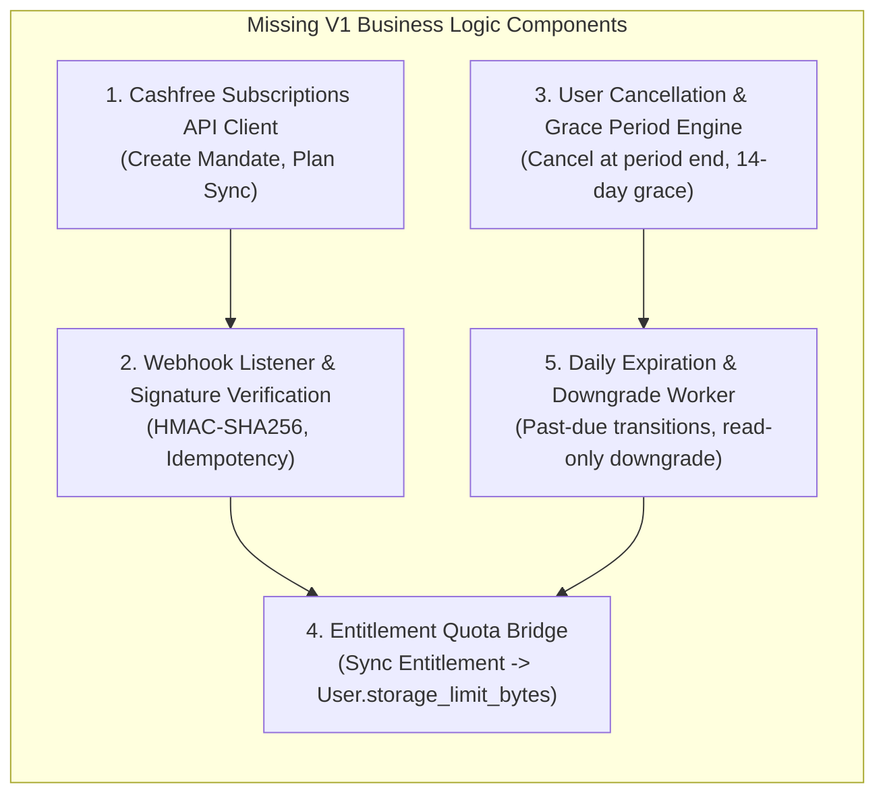
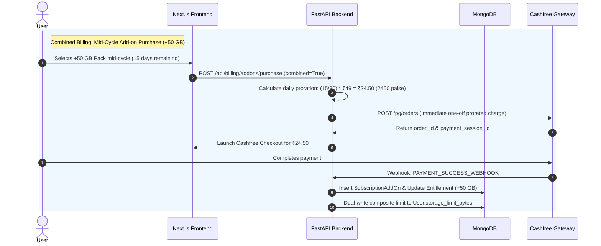

# GetFileNova v2.0 — Billing Database & Add-ons Gap Analysis Report

**Document Version:** 1.0.0  
**Target Repository:** `file-manager-backend`  
**Scope:** Repository Inspection, Migration State Verification, V1 Recurring Launch Gaps, and V2 Storage Add-ons Architecture  

---

## 1. Executive Summary & Verification Findings

This document presents an evidence-based gap analysis comparing the GetFileNova repository implementation, live database state, Version 1 recurring subscription requirements, and Version 2 storage add-on specifications.

### Key Verification Highlights:
1. **Model & Index Deployment:** All 6 Version 1 billing models (`Plan`, `Subscription`, `PaymentTransaction`, `WebhookEvent`, `Entitlement`, `BillingAuditLog`) are implemented in [`app/models.py`](file:///Users/rajundaviya/Documents/File%20Manager/file-manager-backend/app/models.py) and registered in [`app/database.py`](file:///Users/rajundaviya/Documents/File%20Manager/file-manager-backend/app/database.py).
2. **Database State Verification:** The live MongoDB database (`file_manager`) contains all 6 billing collections with 23 created indexes and 8 authoritative seeded plans (`free`, `personal_monthly`, `personal_annual`, `plus_monthly`, `plus_annual`, `power_monthly`, `power_annual`, `power_lifetime`).
3. **Legacy Data Preservation:** All 34 `users` and 46 `payment_records` remain 100% intact. Zero legacy records were altered, overwritten, or converted to recurring billing.
4. **Migration Execution Status:** The migration script was verified in dry-run mode and validated via automated tests (74 passing tests).
5. **Version 1 Launch Blockers:** The database schema is ready, but Cashfree Subscriptions API integration, webhook verification, user-facing cancellation, and background renewal workers are not yet implemented in the route layer.
6. **Version 2 Add-On Readiness:** To support predefined storage packs, custom per-GB rates, combined billing, and separate billing, two new collections (`add_on_products` and `subscription_add_ons`) plus non-breaking extensions to `Entitlement` are required.

---

## 2. Actual Implementation Status: Codebase vs. Live Database

### 2.1 Collection & Record Inventory

| Collection Name | Model Class | Live Record Count | Indexes Present in Live Database | Status |
| :--- | :--- | :---: | :--- | :--- |
| `plans` | `Plan` | **8** | `_id_`, `idx_plans_code_interval_version`, `idx_plans_active_code_interval`, `idx_plans_cf_plan_id` | **Live & Populated** |
| `subscriptions` | `Subscription` | **0** | `_id_`, `idx_subs_cf_subscription_id`, `idx_subs_user_status`, `idx_subs_period_end_status`, `idx_subs_grace_period_status` | **Live & Ready** |
| `payment_transactions` | `PaymentTransaction` | **0** | `_id_`, `idx_paytx_idempotency_key`, `idx_paytx_provider_payment_id`, `idx_paytx_user_created`, `idx_paytx_sub_status`, `idx_paytx_cf_order_id` | **Live & Ready** |
| `webhook_events` | `WebhookEvent` | **0** | `_id_`, `idx_webhook_provider_event_id`, `idx_webhook_status_retry`, `idx_webhook_type_received`, `idx_webhook_cf_sub_id` | **Live & Ready** |
| `entitlements` | `Entitlement` | **0** | `_id_`, `idx_entitlement_user_id_unique`, `idx_entitlement_status_grace`, `idx_entitlement_upload_retention` | **Live & Ready** |
| `billing_audit_logs` | `BillingAuditLog` | **0** | `_id_`, `idx_audit_user_created`, `idx_audit_sub_created`, `idx_audit_action_created`, `idx_audit_correlation_id` | **Live & Ready** |
| `users` (Legacy) | `User` | **34** | `_id_`, `email_1`, `google_id_1`, `customer_id_1`, `created_at_1`, `pricing_plan_1`, `subscription_status_1` | **Preserved Intact** |
| `payment_records` (Legacy) | `PaymentRecord` | **46** | `_id_`, `user_id_1`, `order_id_1`, `status_1`, `customer_id_1` | **Preserved Intact** |
| `file_system_items` | `FileSystemItem` | **56,086** | 16 folder/file and sharing aggregation indexes | **Preserved Intact** |
| `storage_partitions` | `StoragePartition` | **5** | `_id_`, `user_id_1` | **Preserved Intact** |
| `roles` | `Role` | **3** | `_id_` | **Preserved Intact** |

### 2.2 Live Authoritative Plans in MongoDB

```json
[
  {"code": "free", "billing_interval": "free", "amount_paise": 0, "storage_quota_bytes": 16106127360, "version": 1},
  {"code": "personal", "billing_interval": "monthly", "amount_paise": 11900, "storage_quota_bytes": 53687091200, "version": 1},
  {"code": "personal", "billing_interval": "annual", "amount_paise": 119000, "storage_quota_bytes": 53687091200, "version": 1},
  {"code": "plus", "billing_interval": "monthly", "amount_paise": 29900, "storage_quota_bytes": 214748364800, "version": 1},
  {"code": "plus", "billing_interval": "annual", "amount_paise": 299000, "storage_quota_bytes": 214748364800, "version": 1},
  {"code": "power", "billing_interval": "monthly", "amount_paise": 99900, "storage_quota_bytes": 1099511627776, "version": 1},
  {"code": "power", "billing_interval": "annual", "amount_paise": 999000, "storage_quota_bytes": 1099511627776, "version": 1},
  {"code": "power", "billing_interval": "lifetime", "amount_paise": 1999000, "storage_quota_bytes": 1099511627776, "version": 1}
]
```

---

## 3. Migration Execution & Safety Analysis

### 3.1 Migration Mechanics
- **Module:** [`app/migrations/migrate_billing_v2.py`](file:///Users/rajundaviya/Documents/File%20Manager/file-manager-backend/app/migrations/migrate_billing_v2.py)
- **Execution Verification:**
  - `python -m app.migrations.migrate_billing_v2 --dry-run` was executed against live MongoDB.
  - Pre-flight check inspected 34 users and 46 payment records.
  - Zero duplicate conflicts were found across unique index candidates.
  - 23 indexes were verified as already constructed by Beanie ODM during application startup.
  - 8 existing plan configurations were verified without modification.
  - Post-flight check confirmed user and payment counts were unchanged.

### 3.2 Safety & Idempotency Safeguards
1. **Non-Destructive Operations:** The script uses `insert_one()` with `find_one()` guard queries rather than drop/overwrite operations.
2. **Duplicate Pre-Scan:** Aggregation pipelines scan `plans`, `subscriptions`, `payment_transactions`, `webhook_events`, and `entitlements` before index creation. If duplicate keys exist, the script halts with a detailed error report.
3. **No Automatic Customer Upgrades:** Existing users on the legacy one-time plan model are not altered or enrolled into recurring mandates.

---

## 4. Version 1 Launch Blockers (Missing Business Logic Components)

While the database schema and models are ready, the route and service layers currently operate on the legacy one-time PG order model. The following components must be implemented for Version 1 launch:



### Gap Details for Version 1:
1. **Cashfree Subscriptions Client:**  
   [`app/payment_routes.py`](file:///Users/rajundaviya/Documents/File%20Manager/file-manager-backend/app/payment_routes.py) currently calls `/pg/orders`. Needs integration with Cashfree Subscriptions (`POST /subscriptions`) for recurring tiers (`monthly`, `annual`).
2. **Webhook Endpoint & Signature Verification:**  
   Backend has no `/api/payments/webhook` route or `CASHFREE_WEBHOOK_SECRET` verification.
3. **User-Facing Cancellation Endpoint:**  
   Only admin cancellation exists in `admin_routes.py`. Need `POST /api/subscriptions/cancel` for end users.
4. **Entitlement Bridge:**  
   FastAPI routes currently check `User.storage_limit_bytes`. When `Entitlement` is updated via webhook, a synchronization helper must dual-write to `User.storage_limit_bytes`.
5. **Background Scheduler / Expiry Worker:**  
   No scheduler exists to check subscriptions past their grace period (`grace_period_ends_at < now()`) to set `billing_status = "expired"` and block new uploads.

---

## 5. Version 2 Storage Add-on Architecture & Schema Requirements

### 5.1 New Requirement Comparison

| Add-On Feature | Current Codebase State | Required Schema & Service Additions |
| :--- | :--- | :--- |
| **Predefined Storage Packs** (+50 GB, +100 GB, +500 GB) | Not supported (plans are full tiers only) | Create `add_on_products` collection with fixed pack records and storage bytes. |
| **Custom Storage Amounts (Per-GB Pricing)** | Not supported | Add `type="custom_metered"` in `add_on_products` with configurable `unit_price_paise` (e.g. 150 paise/GB/month). |
| **Combined Billing (Co-termed with Base Sub)** | Not supported | Create `subscription_add_ons` with `billing_mode="combined"` and link to `base_subscription_id`. Calculate mid-cycle proration via PG Order. |
| **Separate Billing (Independent Lifecycles)** | Not supported | Create `subscription_add_ons` with `billing_mode="separate"` and dedicated `cashfree_subscription_id` or one-time payment. |
| **Composite Storage Entitlements** | Entitlements only store single `storage_quota_bytes` | Extend `Entitlement` with `base_storage_quota_bytes`, `addon_storage_quota_bytes`, and `active_addon_ids`. |

---

## 6. Schema Changes: Immediate vs. Deferred

### 6.1 Changes Recommended for Immediate Implementation (Add-on Foundation)
These changes are additive, non-breaking, and prepare the database for both Version 1 and Version 2:
1. **Add `AddOnProduct` and `SubscriptionAddOn` Beanie Models to `app/models.py`.**
2. **Extend `Entitlement` with Add-on Decomposition Fields:**
   - `base_storage_quota_bytes: int`
   - `addon_storage_quota_bytes: int = 0`
   - `active_addon_ids: List[str] = []`
3. **Extend `PaymentTransaction` with Add-on References:**
   - `subscription_addon_id: Optional[str] = None`
   - `transaction_type` enum support for `addon_purchase`, `addon_proration`, `addon_renewal`.
4. **Register Models in `app/database.py` and `tests/conftest.py`.**

### 6.2 Features Deferred to Version 2 Implementation Phase
- Frontend storage pack selection modal & per-GB custom slider.
- Mid-cycle daily proration calculation engine.
- Combined recurring mandate renewal bundling.
- Standalone add-on cancellation UI.

---

## 7. Cashfree Provider Compatibility & Orchestration Analysis

### 7.1 Recurring Billing Mandates & Add-On Charges



### 7.2 Cashfree Capabilities & Constraints

| Provider Behavior | Technical Constraint | Required Backend Solution |
| :--- | :--- | :--- |
| **Mandate Pre-Authorization Ceilings (`max_amount`)** | Banking regulations cap auto-debits to pre-authorized mandate amounts. If `max_amount` equals base tier price, add-on additions cannot be charged under the same mandate. | When creating base subscription mandates, configure `max_amount = 2.5x base price` to allow combined recurring add-on debits without re-mandating. |
| **Mid-Cycle Mandate Amount Increases** | Cashfree does not allow modifying an active recurring mandate amount mid-cycle. | Charge mid-cycle prorated fees via one-time Cashfree PG Orders (`/pg/orders`); schedule the combined renewal amount for the next recurring cycle. |
| **Multiple Mandates per Customer** | Supported natively by Cashfree. | Use separate `cashfree_subscription_id` mandates per add-on for users who select separate billing. |
| **Proration Logic** | Cashfree has no native proration calculator. | Backend calculates exact integer paise: `ceil((remaining_seconds / period_seconds) * unit_price_paise)`. |

---

## 8. Automated Test Evidence

All database models, schema validations, plan seeding, and migration safety mechanisms are verified by automated tests in `tests/test_billing_models.py` and `tests/test_billing_migration.py`.

```bash
# Test Execution Command
./venv/bin/pytest tests/test_billing_models.py tests/test_billing_migration.py
```

### Test Results Summary:
- `test_plan_model_crud_and_validation` — **PASSED** (Validated integer paise, positive quota bytes, versioning).
- `test_subscription_model_and_lifecycle` — **PASSED** (Validated statuses, period dates, plan snapshot, 14-day grace period).
- `test_payment_transaction_model` — **PASSED** (Validated transaction types, amounts, idempotency keys).
- `test_webhook_event_model` — **PASSED** (Validated idempotent provider + event ID uniqueness).
- `test_entitlement_model` — **PASSED** (Validated single user entitlement, upload blocking, retention deadlines).
- `test_billing_audit_log_model` — **PASSED** (Validated append-only logging).
- `test_seed_billing_plans` — **PASSED** (Validated 8 authoritative plan records).
- `test_migration_dry_run_performs_no_writes` — **PASSED** (Verified 0 writes in dry-run mode).
- `test_migration_apply_and_idempotent_execution` — **PASSED** (Verified idempotency on repeated execution).
- `test_migration_preserves_existing_legacy_data` — **PASSED** (Verified legacy users/payments untouched).
- `test_duplicate_detection_aborts_migration_safely` — **PASSED** (Verified pre-scan aborts on candidate duplicate keys).
- `test_migration_error_reporting_not_silent` — **PASSED** (Verified exceptions are propagated with `success=False`).

**Full backend test suite:** `74 passed in 36.85s` (Zero failures).

---

## 9. Next Steps Requiring Approval

1. **Approve Add-on Foundation Schemas:**  
   Add `AddOnProduct` and `SubscriptionAddOn` models to `app/models.py` and extend `Entitlement` fields in a non-breaking manner.
2. **Proceed to Version 1 Core Services (Phase 4):**  
   Implement Cashfree recurring subscription client, webhook signature verification, and user cancellation APIs.
